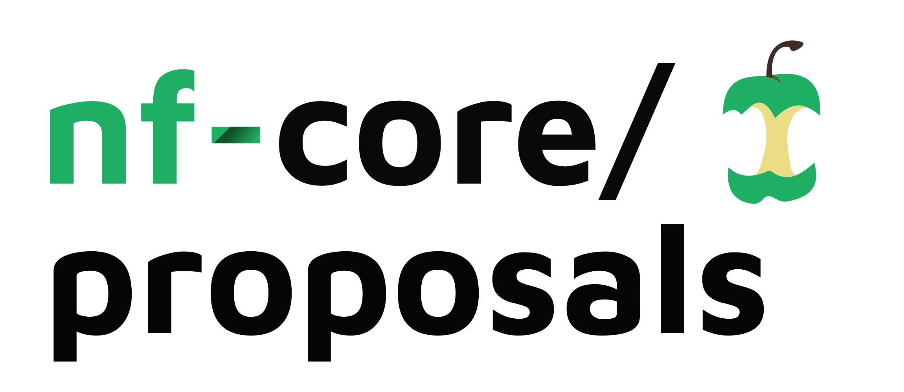

<h1>
  <picture>
    <source media="(prefers-color-scheme: dark)" srcset="docs/images/nfcore-proposals_logo_dark.png">
    
  </picture>
</h1>

This repository is used to track all community proposals for nf-core.

## Proposer Documentation

To make a new proposal, please create a new issue in the repository following the appropriate template:

- [New pipeline](https://github.com/nf-core/proposals/issues/new?template=new_pipeline.yml)
- [New RFC](https://github.com/nf-core/proposals/issues/new?template=new_rfc.yml)
- [New special interest group](https://github.com/nf-core/proposals/issues/new?template=new_special_interest_group.yml)

## Curator Documentation

### Pipelines

**Automated workflow:**

- [x] Issue creation triggers automation that:
  - Adds the 'proposed' label
  - Creates a status comment tracking approvals
- [x] Team members use `/approve` or `/reject` commands in comments
- [x] Automation updates status comment and labels based on approvals
- [x] Acceptance requires either:
  - Two core team members
  - One core team member + one maintainer

**Manual steps required:**

- [ ] Facilitate discussion following [guidance here](https://nf-co.re/docs/checklists/community_governance/core_team#new-pipeline-proposals-and-onboarding)
- [ ] If accepted: Close issue as 'completed'
- [ ] If rejected: Close issue as 'not planned'
- [ ] For timed-out proposals (after 1 year): Add 'timed-out' label and close as 'not planned'
- [ ] Complete remaining onboarding tasks listed [here](https://nf-co.re/docs/checklists/community_governance/core_team#new-pipeline-proposals-and-onboarding)

### RFCs

**Automated workflow:**

- [x] Issue creation triggers automation that:
  - Adds the 'proposed' label
  - Creates a status comment tracking approvals
- [x] Team members use `/approve` or `/reject` commands in comments
- [x] Automation updates status comment and labels based on approvals
- [x] Acceptance requires core team quorum (majority of core team members)

**Manual steps required:**

- [ ] Facilitate discussion on the Issue thread
- [ ] If accepted: Close issue as 'completed'
- [ ] If rejected: Close issue as 'not planned'
- [ ] For timed-out proposals (after 1 year): Add 'timed-out' label and close as 'not planned'

### Special Interest Groups

**Automated workflow:**

- [x] Issue creation triggers automation that:
  - Adds the 'proposed' label
  - Creates a status comment tracking approvals
- [x] Team members use `/approve` or `/reject` commands in comments
- [x] Automation updates status comment and labels based on approvals
- [x] Acceptance requires two core team members

**Manual steps required:**

- [ ] Facilitate discussion on the Issue thread, following the guidance [here](https://nf-co.re/blog/2024/special_interest_groups)
- [ ] If accepted: Close issue as 'completed'
- [ ] If rejected: Close issue as 'not planned'
- [ ] For timed-out proposals (after 1 year): Add 'timed-out' label and close as 'not planned'

## Developer Documentation

### Approval Automation

The repository uses Python-based automation for all proposal types (SIG, RFC, and Pipeline proposals). For detailed information about the automation system, CLI usage, and testing, see the [automation documentation](.github/workflows/lib/README.md).
